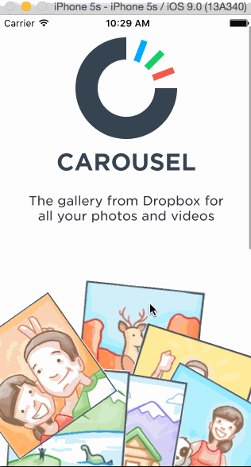

Carousel Mock-up

This is an iOS mock-up for the basic login/logout features of the Carousel app, practicing using views, view properties, and events to create a high fidelity prototype that is difficult to distinguish from a production app. 

Time spent: 20 hours.

Completed user stories:
		
Intro
	Optional: Photo tiles move with scrolling

Sign In
	Tapping on email/password reveals the keyboard and shifts the scrollview and Sign In button up.
	Upon tapping the Sign In button.
		If the username or password fields are empty, user sees an error alert.
		If credentials are incorrect, user sees a loading indicator for 2 seconds followed by an error alert.
		If the credentials are correct, user sees a loading indicator for 2 seconds followed by a transition to the Tutorial screens.
	Optional: When the keyboard is visible, if the user pulls down on the scrollview, it will dismiss the keyboard.

Tutorial Screens
	User can page between the screens
	Optional: User can page between the screens with updated dots
	Optional: Upon reaching the 4th page, hide the dots and show the "Take Carousel for a Spin" button.

Image Timeline
	Display a scrollable view of images.
	User can tap on the conversations button to see the conversations screen (push).
	User can tap on the profile image to see the settings view (modal from below).

Conversations
	User can dismiss the conversations screen

Settings
	User can dismiss the settings screen.
	User can log out 

Walk-through of the user stories:



